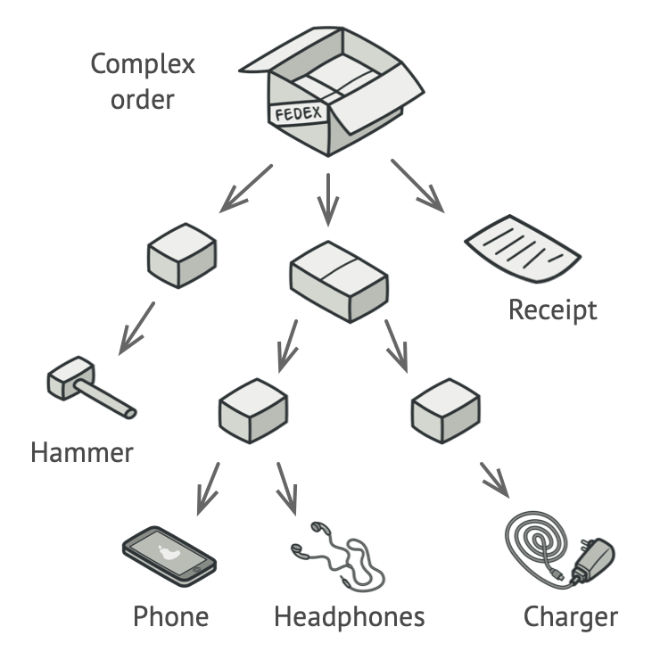
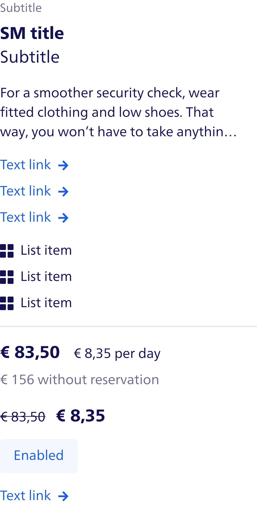

# Atomic Design: Breaking Up is Hard to Do, Enter Compound Components!

If you've been around the frontend development scene for a while, you'd likely be familiar with Atomic Design. You know,
that slick, really systemized approach to building UI components to make everything feel and look modular, reusable, and
oh-so consistent. And it really does deliver on these expectations — at least in simpler projects where design and
interactions are rather straightforward.

But what happens when things get a little more complex? When your UI goes beyond being a mere collection of buttons and
input fields, becoming a dynamic, interactive system that must adapt and respond to users in ways that Atomic Design
likely didn't foresee? That is where the cracks start appearing.

In this article, we're going to dive into those cracks. We will get a closer look at the shortcomings of Atomic Design
for more complex and demanding UIs. But don't worry — we are not here to just highlight the problems. We'll also
introduce you to the Compound Components pattern, which is an even more flexible approach that might just be what you
need. By the end of this, at worst, you will realize how Compound Components can help you deal with state, handle
interactions, and keep your code as clean and scalable as possible — even when your UI is anything but simple.

## What Problem Does Atomic Design Try to Solve?

Before we do a deep dive we have to take a step back and appreciate what Atomic design originally set out to do. We’ve
all been there — you open up a project with a UI that looks like it was designed by five different people, all with
different ideas of what consistency means. Buttons don’t match, input fields are everywhere, and every page feels like a
new adventure… in chaos. Atomic Design as conceived by Brad Frost was the silver bullet to change all that.

Basically, Atomic Design deals with creating consistency and modularity in your UI. It means breaking the interface down
to its very smallest building blocks, inspired by how matter is constructed in the real world. Just like in chemistry,
where atoms combine into molecules and those molecules come together to create organisms, atomic design uses these terms
for different levels of UI components. Atoms would be your basic, indestructible elements: things such as buttons or
input fields. Molecules would be groups of atoms and would be something like a form label paired with an input field.
Therefore, organisms would be more complex structures, like, for instance, a whole form with multiple molecules
performing together. This way, in thinking through every little piece of your UI, all the pieces will be reusable and
fit together predictably. While this is wonderful as a philosophy, UI design just doesn't always lend itself to being
that cut-and-dried in the real world. User interfaces more often call for flexibility, adaptability, and dynamic
interactions that don't normally fit within predefined categories. To this end, the very rigid structure of atomic
design sometimes tends to fall a little short at dealing with more subtle and complex demands made upon modern UI
development.

### The limits of Atomic Design

Atomic Design is a really nice starting point when looking to create consistent, modular UI components, but it's
definitely not perfect — especially when you need to cope with all the messy realities of modern web apps. The problem
here is it's a bit too rigid. On paper, the whole idea that atoms form molecules and molecules manifest as organisms is
nice, but when your UI needs to be flexible and responsive to real-world interactions, this strict hierarchy can start
to feel a bit like a straightjacket.

One of the biggest headaches has to do with state and dynamic behavior. UIs rarely exist in a static vacuum; they need
to be dynamic, responsive, and sometimes behave a little jig based on the whims of a user. Take for instance, a form.
How would an Atomic Design structure break this down? Well, it'd go: the form itself as an organism; the form fieldset
as molecules; and the individual input elements as atoms.

We start with a Input field

```tsx
// Atom: TextInput.tsx
import type { ChangeEvent } from 'react'

interface TextInputProps {
  value: string
  onChange: (e: ChangeEvent<HTMLInputElement>) => void
}

export function TextInput({ value, onChange }: TextInputProps) {
  return <input type="text" value={value} onChange={onChange} />
}
```

A Form field will render the Input field

```tsx
// Molecule: FormFields.tsx
import type { ChangeEvent, Dispatch, SetStateAction } from 'react'
import { TextInput } from './TextInput'

interface FormFieldsProps {
  formData: { name: string; email: string }
  setFormData: Dispatch<SetStateAction<{ name: string; email: string }>>
}

export function FormFields({ formData, setFormData }: FormFieldsProps) {
  return (
    <>
      <TextInput value={formData.name} onChange={(e) => setFormData({ ...formData, name: e.target.value })} />
      <TextInput value={formData.email} onChange={(e) => setFormData({ ...formData, email: e.target.value })} />
    </>
  )
}
```

And at the top level, we have the Form organism that renders the FormFields molecule and manages the form state

```tsx
// Organism: Form.tsx
import type { ChangeEvent, Dispatch, SetStateAction } from 'react'
import { FormFields } from './FormFields'

interface FormProps {
  formData: { name: string; email: string }
  setFormData: Dispatch<SetStateAction<{ name: string; email: string }>>
}

export function Form({ formData, setFormData }: FormProps) {
  return (
    <form>
      <FormFields formData={formData} setFormData={setFormData} />
      <button type="submit" disabled={!formData.name || !formData.email}>
        Submit
      </button>
    </form>
  )
}
```

But what if you need the form to validate input fields, display error messages, disable submittal until certain
conditions are met? It gets exhausting managing all these interactions across different layers. You find yourself having
state management scattered between the form molecule and the modal organism — exactly where tangled logic and a rigid
structure that is hard to maintain comes from.

The Input now gets an extra prop for the error

```tsx
// Atom: TextInput.tsx
import type { ChangeEvent } from 'react'

interface TextInputProps {
  value: string
  onChange: (e: ChangeEvent<HTMLInputElement>) => void
  error?: string
}

export function TextInput({ value, onChange, error }: TextInputProps) {
  return (
    <>
      <input type="text" value={value} onChange={onChange} />
      {error && <span className="error-message">{error}</span>}
    </>
  )
}
```

The FormFields molecule now maps this error object to the TextInput component

```tsx
// Molecule: FormFields.tsx
import type { ChangeEvent, Dispatch, SetStateAction } from 'react'
import { TextInput } from './TextInput'

interface FormFieldsProps {
  formData: { name: string; email: string }
  setFormData: Dispatch<SetStateAction<{ name: string; email: string }>>
  errors: { name?: string; email?: string }
}

export function FormFields({ formData, setFormData, errors }: FormFieldsProps) {
  return (
    <>
      <TextInput
        value={formData.name}
        onChange={(e) => setFormData({ ...formData, name: e.target.value })}
        errors={errors?.name}
      />
      <TextInput
        value={formData.email}
        onChange={(e) => setFormData({ ...formData, email: e.target.value })}
        errors={errors.email}
      />
    </>
  )
}
```

While the Form organism now has to manage the form validation logic

```tsx
// Organism: Form.tsx
import { type ChangeEvent, type Dispatch, type SetStateAction, useState } from 'react'
import { FormFields } from './FormFields'

interface FormProps {
  formData: { name: string; email: string }
  setFormData: Dispatch<SetStateAction<{ name: string; email: string }>>
}

export function Form({ formData, setFormData }: FormProps) {
  const [errors, setErrors] = useState<{ name?: string; email?: string }>({})

  const validate = () => {
    const newErrors: {
      name?: string
      email?: string
    } = {}

    if (!formData.name) {
      newErrors.name = 'Name is required'
    } else {
      delete newErrors.name
    }

    if (!formData.email) {
      newErrors.email = 'Email is required'
    } else {
      delete newErrors.email
    }

    setErrors(newErrors)
    return Object.keys(newErrors).length === 0
  }

  const handleSubmit = (e: FormEvent) => {
    e.preventDefault()
    const isValid = validate()
    if (isValid) {
      // submit form
    }
  }

  return (
    <form onSubmit={handleSubmit}>
      <FormFields formData={formData} setFormData={setFormData} errors={errors} />
      <button type="submit" disabled={!formData.name || !formData.email}>
        Submit
      </button>
    </form>
  )
}
```

This undermines the very purpose of reusability and modularity that Atomic Design is supposed to serve with such changes
to a number of high-impact components in order to extend or adjust form behavior.

Then, there is the question of relationships between components. Your app's going to grow, and before you know it, you
realize that you are drowning in tones of repetitive code or, even worse, some overly complicated component hierarchies
that become a headache to handle. It doesn't stop there — managing different styles or variations of the same component
can add another layer of complexity. The places where atomic design can get overly rigid are in supporting multiple
themes, sizes, or interactive states; it's quite difficult to maintain consistency without repeating a lot of code or
convoluted overrides. The tight structure that Atomic Design provides gives you a very good framework to get started,
but sometimes boxes you in on things that really need to be flexible or adaptive for a project.

## Lessons from Atomic Design

Although atomic design has its shortcomings, it has endowed us with experience to move forward into other design
patterns. First and foremost, it brings out the importance of _structure and hierarchy_ in UI development. Breaking
interfaces down into smaller manageable components allows atomic design to help us think more systematically about how
to build and organize our UIs. This approach not only engenders consistency, but makes the codebase easier to comprehend
and maintain as a whole.

Another critical takeaway is _reusability_. Atomic Design advises us that elements should be created for many different
uses across different parts of an application. This is a fundamental principle of design systems: encouraging re-use of
components, removing duplication, and helping to keep consistency in the design throughout a project. While the tight
hierarchy that Atomic Design enforces doesn't work for more complex projects very often, the idea itself—making elements
which can be reused—remains at the heart of good UI design.

Finally, Atomic Design makes one realize the importance of _consistency_. Visual design, behavior, or the way components
are structured — it leads to a more intuitive and predictive user experience when it is consistent. While the very rigid
structure of Atomic Design might not work best in all scenarios, such key principles that it places its emphasis on are
things which can be applied to other, more flexible design patterns.

## Atomic Design vs Compound patterns, it is just an extension of atomic design

From my experience, Atomic Design proved to be an excellent basis for creating UI components. It is very robust because
it categorizes the elements on atoms, molecules, organisms, templates, and pages. At the same time, this makes it easier
to construct consistent reusable components. However, as applications grow in complexity, the rigid nature of Atomic
Design can start to feel restrictive. That's where Compound Components come in — they take the foundation Atomic Design
provides and extend it to offer more flexibility and adaptability.

Compound Components, which are based on the Composite Pattern in software development, take the idea of grouping
individual objects into tree structures and apply it to frontend development. In this pattern, the parent component
plays a central role, managing shared state and logic, while child components handle specific tasks like rendering
content or handling user input.



As seen in this example we see a complex order contains multiple boxes, each containing their own items inside. A box on
itself can contain a new box, following the composite pattern. In the end a box can contain a single item, which is the
leaf of the tree.

The main difference-and where Compound Components improve on Atomic Design-is in how they handle the relationships
between components. In Atomic Design, components are often defined as isolated pieces that fit into strict categories,
but Compound Components focus on how those pieces interact with each other. Instead of rigidly following predefined
levels, Compound Components let state and behavior flow naturally between parent and child components, giving you a much
more dynamic and flexible system.

So, while Compound Components won’t replace Atomic Design, it enhances it. It takes the strong foundation of structure
and consistency and layer in the flexibility needed to handle the growing complexity of modern web applications. It’s
about building a system that not only looks good on paper but also works smoothly in the real world.

### Getting to Know the Compound Pattern

The reason the Compound Pattern works so well in React is because it makes your components more flexible and easier to
manage. Because the parent component is managing state and business logic, the children can focus on their specific
roles without concern of how everything ties together. That simplifies things and moves you away from this commonly
experienced problem in React called "prop drilling", where you end up passing props through multiple layers of
components just to get data from one place to another.

Let’s break it down with a simple example in React using a Tabs component

We'll create the `Tabs` component, which manages the shared state (active tab) and makes it available via `TabsContext`
(exported by a hook `useTabs`).

```tsx
// Tabs.tsx
import { createContext, useState, type PropsWithChildren } from 'react'

interface TabsContextProps {
  activeTab: string
  setActiveTab: (index: string) => void
}

// Create the context to hold the active tab state and setter function
const TabsContext = createContext<TabsContextProps | undefined>(undefined)

export function useTabs() {
  const context = useContext(TabsContext)

  if (!context) {
    throw new Error('useTabs must be used within a Tabs component')
  }

  return context
}

interface TabsProps {
  defaultValue?: string
}

// Tabs component manages the state and provides context to its children
export function Tabs({ children, defaultValue }: PropsWithChildren<TabsProps>) {
  const [activeTab, setActiveTab] = useState(defaultValue)

  return (
    <TabsContext.Provider value={{ activeTab, setActiveTab }}>
      <div className="tabs">{children}</div>
    </TabsContext.Provider>
  )
}
```

The `TabsList` will act as a container for the TabTrigger components, and TabTrigger will handle switching between tabs.

```tsx
// TabsList.tsx
export function TabsList({ children }: PropsWithChildren) {
  return (
    <div role="tablist" className="tabs-list">
      {children}
    </div>
  )
}
```

The TabList needs a TabTrigger component to handle the tab switching

```tsx
// TabTrigger.tsx
import { useTabs } from './Tabs'

interface TabTriggerProps {
  value: string
}

export function TabTrigger({ value, children }: PropsWithChildren<TabTriggerProps>) {
  const { activeTab, setActiveTab } = useTabs()

  return (
    <button
      role="tab"
      aria-selected={activeTab === value}
      aria-controls={`panel-${value}`}
      id={`tab-${value}`}
      onClick={() => setActiveTab(value)}
      className={`tab-trigger ${activeTab === value ? 'active' : ''}`}
    >
      {children}
    </button>
  )
}
```

And finally, the `TabsContent` component will render the content of the active tab

```tsx
// TabsContent.tsx
import { useTabs } from './Tabs'

interface TabsContentProps {
  value: string
}

export function TabsContent({ value, children }: PropsWithChildren<TabsContentProps>) {
  const { activeTab } = useTabs()

  return activeTab === value ? (
    <div role="tabpanel" aria-labelledby={`tab-${value}`} id={`panel-${value}`}>
      {children}
    </div>
  ) : null
}
```

When putting this all together, you get a flexible and dynamic Tabs component that can be easily customized and extended
to fit your needs.

```tsx
export function TabExample() {
  return (
    <Tabs defaultValue="Tab 1">
      <TabsList>
        <TabTrigger value="Tab 1">Content 1</TabTrigger>
        <TabTrigger value="Tab 2">Content 2</TabTrigger>
        <TabTrigger value="Tab 3">Content 3</TabTrigger>
      </TabsList>
      <TabsContent value="Tab 1">
        <p>Tab 1 content</p>
      </TabsContent>
      <TabsContent value="Tab 2">
        <p>Tab 2 content</p>
      </TabsContent>
      <TabsContent value="Tab 3">
        <p>Tab 3 content</p>
        <div>
          We can add any content we want here
          
        </div>
      </TabsContent>
    </Tabs>
  )
}
```

This example illustrates some of the benefits of using the Compound Component Pattern in React. By separating concerns
between `Tabs`, `TabTrigger`, and `TabsContent`, each component focuses on a specific task while sharing state through
context. Furthermore, it simplifies not only the management of complex interactions but also the flexibility in how such
components could be used and further customized.

### Why the Compound Pattern Works

What ends up making the Compound Component Pattern so powerful is it centralizes state management to the parent
component while allowing child components to perform their specific tasks on their own. Going back to our `Tabs`
example, the `Tabs` component regulates the active tab state and communicates that down to its child components
`TabTrigger` and `TabsContent` via context. This design eliminates the need to use prop drilling, where props are passed
through many levels. Instead, it simply provides a way for child components to easily access and consume this shared
state. For example, the `TabTrigger` component does not need any explicit knowledge about how the tabs system works. Its
only role is to fire an active tab change when clicked while the `TabsContent` component dynamically renders content
based on the current state. This division of responsibilities fosters a clear and maintainable framework, allowing for
the seamless scaling of the UI without intertwining the logic across different components. This is pretty useful when
building any dynamic UI whose aim is to adopt all the possible user contexts and the user interactions.

Another strong advantage of the Compound Component Pattern is flexibility and personalization, as can be seen in the
`Tabs` example. Given that state management is within the `Tabs` component, adding new `TabTrigger` components or
`TabsContent` panels is remarkably easy. Every new tab works perfectly, without any additional overhead, as the parent
takes care of the state updates and synchronizations. This makes customization very easy, as the children can be themed
or changed without affecting the bigger picture. Another advantage provided by the use of shared state throughout the
components is the reduction in the chances of state inconsistency among different components. This approach not only
enhances the readability and maintainability of code but also fosters the creation of dynamic, interactive, and scalable
user interfaces that grow with the application. The ability to extend the interface with ease, while preserving
consistency and managing complexity, makes the Compound Component Pattern a go-to option for constructing rich user
interfaces in React applications.

### Challenges of the Compound Pattern

Although the Compound Component Pattern has great flexibility in its application, this comes with several downsides. For
instance, as the application grows, the complexity for managing shared state across increasing numbers of components
quickly increases, which in turn can make maintenance and debugging harder. In our `Tabs` example, while the pattern
keeps components modular, it's pretty hard to trace the shared state flow across the layers when more components and
interactions are involved. This pattern also introduces a rather increased learning curve, mainly for developers not yet
well-acquainted with some advanced React concepts like context and state management. Understanding how components can
communicate without explicitly passing props down can be really hard.

The other concern is type safety. However, since the shared state is very often accessed through context, ensuring that
type safety is strong in each component becomes even more cumbersome with TypeScript. Mistakes in types or state can
lead to runtime errors, and tracking them at development time becomes so much more difficult.

Lastly, this pattern may not always work well with deeply nested components or fragments, where context may not
propagate cleanly, leading to broken functionality or unexpected behavior. Managing these nested layers requires careful
structuring to avoid issues, which can complicate the implementation even further.

## Breaking Down the Thought Process

When working on large, complex UI designs, it’s easy to feel overwhelmed by the sheer number of components and
interactions that need to be managed. The more the design grows, the more complex it becomes, and suddenly, what started
off as a quite straightforward project became a tangled mess of state management, props, and tightly-coupled components.
There's where so many developers and designers have hit a wall: How do you hold up flexibility and scalability without
sacrificing clarity or control?

The Compound Components pattern offers a way out of this maze, but it comes with its own set of challenges. It’s not
just about building components; it’s about understanding how they fit together, how they should communicate, and how to
structure them so that they remain flexible as your project evolves. This thought process can be difficult to master,
especially when you’re dealing with the demands of a large design system.

In this section, I'll break out, step by step, how I approach these challenges. We'll see how to deconstruct complex
designs into manageable pieces, how to handle state and logic without losing your mind, and how to design APIs that make
your components easy to use and extend. I hope to make the Compound Components pattern more accessible, helping you to
confidently apply it to even the most challenging projects.

### Understanding the Requirements

To effectively employ the Compound Components pattern, first you have to deeply know the requirements of your UI. Now,
this may go without saying, but in the rush to start writing code, it usually gets overlooked. Before you start to write
a line of code, take a step back and evaluate what your interface needs to pull off. What are the key interactions and
behaviors? How will different components have to communicate with each other? It's good to know and understand these
needs upfront, as it sets the base for all that would follow. Below are some personal tips that have helped me to
deconstruct and manage complex UI projects effectively:

Begin with the User Experience: **Understanding of the user journey** is a UX designer's primary responsibility, yet
that does not mean developers can't or shouldn't be involved. Contributing to UX design allows developers to provide
their valuable insight and see what helps in creating components that truly meet the user's needs. For example, at
Schiphol, we’ve They achieved great success by having UX designers and developers frequently meet and discuss emerging
user needs and features. This collaboration allows us to align our visions, so that what is designed and what is
technically implemented are feasible and optimized. By focusing on user interactions and early feedback, it is possible
to highlight the really necessary components and understand how they should behave, thereby allowing for easier
development and more consistency across the user experience.

**Break down big pictures**: Once the user journey has been identified, break big pictures down into more digestible
pieces. Identify major components in each interaction. For instance, on a form, consider every single input field and
buttons validation messages are separate components, and it shows their relationships to each other, as well as how they
might Work together, hence, you are able to plan their interaction. This way, it not only indicates how different
components are related and how they work in relation to one another but also may help you to see variations and states
that each of these subcomponents may take various forms. It is this foresight that inspires one to craft more robust and
adaptable subcomponents, and thus permit the easier development and management of larger, more complex components. The
clarity of such , The relationships and behavior of components will, in turn, allow your UI to be changed much more
easily, even when requirements Change.

**Define Component Responsibilities**: Explain what each part is supposed to do. A common mistake is giving too much
responsibility to one component, which makes it harder to take care of and improve. By clearly explaining roles — like
having a single main component in charge of the form's state while its smaller parts handle specific input activities,
you can create a structure that is easier to manage and organize.

**Plan for flexibility**: Consider how your components might need to evolve. Ask yourself: How can these components be
reused in different contexts? What level of customization is necessary? By planning for flexibility, you can design
components that easily adapt to new needs, with minimal need for future major overhauls.

**Document Your Thought Process**: It might sound tedious, but documenting your thought process can be incredibly
valuable. Write down the requirements you’ve identified, the interactions you’re planning for, and the roles of each
component. This not only keeps you focused but also makes it easier to communicate your design decisions with your team.

### How to identify reusable components

Think of designing UI components like putting together a car. A small component, like a tire or a steering wheel, is
pretty simple and understandable in functionality. But when you start looking at a car as a whole, it’s made up of many
different parts working together. The key to building an efficient vehicle lies in recognizing which parts can be reused
across different models. Similarly, in UI design, smaller components like buttons are straightforward, but when you
encounter larger, more complex elements, like a fully designed card, the challenge is breaking it down into reusable
parts that can fit into other sections of your “vehicle.”

Let's break down a card component into smaller, reusable parts. This example is from our Schiphol website and design
system.


Compared to other interactive active components, such as tabs that involve active states and user input handling, this
is a purely presentational component. This avoids complicated state management but offers invaluable lessons in how best
to structure and arrange content in a consistent, reusable manner. The Card has two main, well-defined regions: the
**header** and the **content**. Both are designed for specific purposes and include specific layout directives that
foster flexibility in various applications while ensuring continuity.


#### Card header

Starting with the header, there are two key elements: an image and a badge. The image is the dominant visual asset, and
it typically spans the width of the card, providing a strong visual hook. The **badge**, on the other hand, acts as a
label or status indicator and is consistently positioned in the same fixed spot—usually in one of the corners of the
image. This badge placement ensures that, no matter the variation in content or image size, the badge remains visible
and clearly conveys important information to the user.


#### Header in code

Let's first create a Badge component. In the example I'm using a forwardRef function that enables the use of Polymorphic
components. This allows the Badge component to be rendered as a `span` by default but can be changed to a different
element, like a `div`, if needed. This flexibility ensures that the Badge component can be easily adapted to different
layouts and designs without having to create multiple components for each variation. If you want to read more about
Polymorphic components, check out this
[article](https://www.freecodecamp.org/news/build-strongly-typed-polymorphic-components-with-react-and-typescript/).

````tsx
import { cloneElement, type ReactElement } from 'react'

import { cx } from 'class-variance-authority'

import { forwardRef } from '../helpers' // A helper function to type forwardRef and create a Polymorphic component
import { badgeVariants, type BadgeVariantsProps } from './badge-variants' // Styles for different badge variants

export interface BadgeProps extends BadgeVariantsProps {
  icon?: ReactElement // Icon to display in the badge, optional
}

const defaultAs = 'span' as const

/**
 * Badges are used to display a small amount of information, such as a discount or status.
 * Extends the native `span` element.
 *
 * @param variant - Button intent (primary, privium, discount), default is `default`
 * @param icon - Icon to display in the badge
 * @param children - Content to display in the badge
 * @param as - Element to render as, defaults to `span`
 * @param ref - Forwarded ref
 *
 * @example
 * ```
 * <Badge variant="default">New</Badge>
 * ```
 *
 * @example
 * ```
 * <Badge variant="privium" icon={<Icon />}>Privium</Badge>
 * ```
 */
export const Badge = forwardRef<BadgeProps, typeof defaultAs>(
  ({ children, className, icon, variant = 'default', as = defaultAs, ...props }, ref) => {
    const Component = as

    return (
      <Component ref={ref} {...props} className={cx(badgeVariants({ variant }), className)}>
        {icon ? (
          <>
            {cloneElement(icon, {
              width: 16,
              height: 16,
            })}
          </>
        ) : null}
        {children}
      </Component>
    )
  },
)

Badge.id = 'Badge' // Unique identifier for the component for rendering in Compound Components
Badge.displayName = 'Badge' // Display name for the component in React DevTools
````

Resulting in the Badge component


Next is the Image component. The Image component is a simple wrapper around the native `img` element, but can be
adjusted with the Polymorphic component option.

````tsx
import { twMerge } from 'tailwind-merge'

import { forwardRef } from '../helpers' // A helper function to type forwardRef and create a Polymorphic component
import { imageVariants, type ImageVariantsProps } from './image-variants' // Styles for different image variants

export interface ImageProps extends ImageVariantsProps {}

const defaultAs = 'img' as const

/**
 * Image component for displaying images.
 * Extends the native `img` HTML element.
 *
 * @param ratio - Aspect ratio of the image (square, 3:2, 1:1), default is `square`
 * @param fit - Image fit (contain, cover), default is `cover`
 * @param ref - Forwarded ref
 *
 * @example
 * ```
 * <Image src="/path/to/image.jpg" alt="Description of image" />
 * ```
 *
 * @example
 * ```
 * <Image src="/path/to/image.jpg" alt="Description of image" ratio="3:2" />
 * ```
 */
export const Image = forwardRef<ImageProps, typeof defaultAs>(
  ({ children, fit = 'cover', ratio = 'square', className, as = defaultAs, ...props }, ref) => {
    const Component = as

    return (
      <Component ref={ref} {...props} className={twMerge(imageVariants({ ratio, fit }), className)}>
        {children}
      </Component>
    )
  },
)

Image.id = 'Image' // Unique identifier for the component for rendering in Compound Components
Image.displayName = 'Image' // Display name for the component in React DevTools
````

Resulting in the Image component


Now we can create the CardHeader component. The CardHeader component is a simple container that holds the Image and
Badge components. It is designed to be flexible and can be easily customized to fit different layouts and designs.

````tsx
import { cloneElement } from 'react'

import { cx } from 'class-variance-authority'

import { filterChildrenOnId, forwardRef, getValidChildren, mapChildren } from '../../helpers' // Helper functions for filtering, mapping, and validating children

export interface CardHeaderProps {}

const defaultAs = 'div' as const

/**
 * Card header is used to display the main header of a card.
 * Used in combination with the `Card` component and `Image` and `Badge` components.
 *
 * @param children - The content to display in the card header.
 * @param as - The element to render the card header as. Defaults to a div tag.
 * @param ref - The ref to attach to the card header.
 *
 * @example
 * ```
 * <CardHeader>
 *  <Image src="https://via.placeholder.com/450x500" alt="placeholder" />
 * </CardHeader>
 * ```
 *
 * @example
 * ```
 * <CardHeader>
 *  <Badge variant="default">Badge</Badge>
 *  <Image src="https://via.placeholder.com/450x500" alt="placeholder" />
 * </CardHeader>
 * ```
 */
export const CardHeader = forwardRef<CardHeaderProps, typeof defaultAs>(
  ({ children, className, as = defaultAs, ...props }, ref) => {
    const Component = as
    const validChildren = getValidChildren(children) // Filter out invalid children (null, undefined, etc.)

    // Apply classes to children
    const clones = mapChildren(validChildren, (child) => {
      switch (child.type.id) {
        case 'Badge':
          return cloneElement(child, {
            className: cx(
              'absolute bottom-050 left-050 z-10', // Position the badge in the bottom left corner
              child.props?.className,
            ),
          })

        default:
          return null
      }
    })

    return (
      <Component ref={ref} {...props} className={cx('relative flex', className)}>
        {filterChildrenOnId(clones, ['Badge'])}
        <div className="relative w-full overflow-hidden rounded-small">{filterChildrenOnId(clones, ['Image'])}</div>
      </Component>
    )
  },
)

CardHeader.id = 'CardHeader'
CardHeader.displayName = 'CardHeader'
````

#### Card content

Below the header, the **content** section consists of a collection of multiple items that follow a structured layout.
All cards feature a **title**, which for this content section is a required component. The opposite is true for the
**subtitle**, which may optionally appear. It might show up underneath the title on a particular card variation, or
lower in the card - perhaps underneath supplemental text or a list of items. Each possible placement of the subtitle
comes with its own styling rules, ensuring that even though the placement varies, the card maintains visual consistency
and readability. Within the content section the developer can add any predefined content, such as a list of items, a
paragraph of text, or a button. These content items are flexible and can be arranged in any order, allowing for a
variety of card layouts while maintaining a consistent visual style.



One of the most important aspects of the content section is the fact that every element, starting from the text links
down to the list items to price information, all have a fixed spacing and layout structure. For instance, each text link
and each list item has equal spacing between the elements, which makes them neat and organized. These fixed spacings and
alignments are important in maintaining the integrity of the card when the amount of its content may change. A clearly
defined layout grid or utility-based spacing—such as margin or padding classes—will ensure these elements always remain
consistent, regardless of the content. CSS grid or flexbox is a great choice for handling this layout because it
provides the necessary structure but keeps the code modular and adaptable. Let's create the Card component.

````tsx
import { cloneElement } from 'react'

import { cx } from 'class-variance-authority'

import { filterChildrenOnId, forwardRef, getValidChildren, mapChildren } from '../../helpers' // Helper functions for filtering, mapping, and validating children

export interface CardContentProps {}

const defaultAs = 'div' as const

/**
 * Card content is used to display the main content of a card.
 * Used in combination with the `Card` component.
 * Places the `CardTitle` and `CardSubTitle` components at the top of the content.
 *
 * @param children - The content to display in the card content. CardTitle is a required child.
 * @param as - The element to render the card content as. Defaults to a div tag.
 * @param ref - The ref to attach to the card content.
 *
 * @example
 * ```
 * <CardContent>
 *  <CardTitle>Title</CardTitle>
 *  <CardSubTitle>Sub Title</CardSubTitle>
 *  <Paragraph>
 *    For a smoother security check, wear fitted clothing and low shoes.
 *    That way, you won’t have to take anything off.
 *  </Paragraph>
 * </CardContent>
 * ```
 *
 */
export const CardContent = forwardRef<CardContentProps, typeof defaultAs>(
  ({ children, className, as = defaultAs, ...props }, ref) => {
    const Component = as
    const validChildren = getValidChildren(children) // Filter out invalid children (null, undefined, etc.)

    // Apply classes to children based on their type
    const clones = mapChildren(validChildren, (child) => {
      switch (child.type?.id) {
        case 'Paragraph':
          return cloneElement(child, {
            className: cx('line-clamp-3', child.props?.className), // Apply line clamp to paragraph
          })
        default:
          return child // Return the child as is
      }
    })

    const title = filterChildrenOnId(clones, ['CardTitle']) // Filter out the CardTitle component

    if (!title.length) {
      throw new Error('CardContent must contain a CardTitle component') // Throw an error if CardTitle is missing, as it is required
    }

    return (
      <Component
        ref={ref}
        {...props}
        className={cx('relative mt-gap-lg w-full flex-1 pr-gap-xl text-color-text-primary', className)}
      >
        <div className="flex flex-col gap-gap-xs">{filterChildrenOnId(clones, ['CardTitle', 'CardSubTitle'])}</div>
        <div className="mt-gap-lg flex max-w-fit flex-col items-start justify-start gap-gap-lg">
          {filterChildrenOnId(clones, ['CardTitle', 'CardSubTitle'], true)}
        </div>
      </Component>
    )
  },
)

CardContent.id = 'CardContent' // Unique identifier for the component for rendering in Compound Components
CardContent.displayName = 'CardContent' // Display name for the component in React DevTools
````

Finally, the Card component. The Card component is the main container that holds the CardHeader and CardContent
components. It is designed to be flexible and can be easily customized to fit different layouts and designs.

````tsx
import { cloneElement } from 'react'

import { cx } from 'class-variance-authority'

import { filterChildrenOnId, forwardRef, getValidChildren, mapChildren, sortChildren } from '../helpers' // Helper functions for filtering, mapping, and validating children
import { cardHeaderVariants, type CardHeaderVariantsProps } from './header/card-header-variants' // Styles for different card header variants

export interface CardProps extends CardHeaderVariantsProps {}
const defaultAs = 'section' as const

/**
 * A card is used to display content in a structured manner.
 * Used in combination with the `CardHeader` and `CardContent` components.
 *
 * @param children - The content to display in the card.
 * @param as - The element to render the card as. Defaults to a section tag.
 * @param ref - The ref to attach to the card.
 *
 * @example
 * ```
 * <Card>
 *  <CardHeader>
 *    <Image src="https://via.placeholder.com/450x500" alt="placeholder" />
 *  </CardHeader>
 *  <CardContent>
 *    <CardTitle>Title</CardTitle>
 *    <CardSubTitle>Sub Title</CardSubTitle>
 *    <Paragraph>
 *      For a smoother security check, wear fitted clothing and low shoes.
 *      That way, you won’t have to take anything off.
 *    </Paragraph>
 *  </CardContent>
 * </Card>
 * ```
 */
export const Card = forwardRef<CardProps, typeof defaultAs>(
  ({ children, className, as = defaultAs, background = 'on-white', intent = 'default', ...props }, ref) => {
    const Component = as
    const validChildren = getValidChildren(children)

    // Apply classes to children (mainly image)
    // We always place the CardContent first, then the CardHeader
    // Filter the children to only include CardContent and CardHeader
    const clones = sortChildren(
      filterChildrenOnId(
        mapChildren(validChildren, (child) => {
          switch (child.type?.id) {
            case 'CardHeader':
              return cloneElement(child, {
                className: cx('rounded-small', cardHeaderVariants({ background, intent }), child.props?.className),
              })
            default:
              return child
          }
        }),
        ['CardContent', 'CardHeader'],
      ),
      (a, b) => {
        if (a.type.id === 'CardContent') {
          return -1
        }
        if (b.type.id === 'CardContent') {
          return 1
        }
        return 0
      },
    )

    return (
      <Component
        ref={ref}
        {...props}
        className={cx(
          'group flex flex-col-reverse no-underline',
          'focus:outline-color-border-focus-on-white',
          'focus:border-color-border-focus-on-white',
          'outline-none outline-offset-0 focus:outline',
          className,
        )}
      >
        {clones}
      </Component>
    )
  },
)

Card.id = 'Card' // Unique identifier for the component for rendering in Compound Components
Card.displayName = 'Card' // Display name for the component in React DevTools
````

With a full understanding of how this card is structured, let's think about how the API for this component would Look in
a frontend application. Since a card is divided into reusable sections, header, badge, image, title, subtitle, and
content, all of which can be passed as props or child components to easily customize and render various variations in
the card. For instance, a possible API for rendering this card could look like this:

```tsx
export function Card() {
  return (
    <Card>
      <CardHeader>
        <Badge variant="default">Badge</Badge>
        <Image alt="placeholder" src="https://via.placeholder.com/450x500" />
      </CardHeader>
      <CardContent>
        <CardSubTitle>Sub Title</CardSubTitle>
        <CardTitle>Title</CardTitle>
        <Paragraph>
          For a smoother security check, wear fitted clothing and low shoes. That way, you won’t have to take anything
          off.
        </Paragraph>
        <List>
          <ListItem>
            <TextLink icon={<ArrowRight />}>List Item</TextLink>
          </ListItem>
          <ListItem>
            <TextLink icon={<ArrowRight />}>List Item 2</TextLink>
          </ListItem>
        </List>
        <List>
          <ListItem icon={<Categories />}>List Item</ListItem>
          <ListItem icon={<Categories />}>
            List Item 2 Lorem ipsum dolor sit amet, consectetur adipisicing elit. Explicabo tempora consequatur nulla ut
            ab nemo? Quidem mollitia perferendis adipisci accusantium alias numquam debitis iusto explicabo. Ullam ipsa
            placeat laborum qui.
          </ListItem>
        </List>
        <Divider />
        <ButtonGroup>
          <Button intent="primary">Book here</Button>
          <TextLink href="#" icon={<ArrowRight />}>
            More info
          </TextLink>
        </ButtonGroup>
      </CardContent>
    </Card>
  )
}
```

Accordingly, this API allows for a high degree of customization and flexibility to the developer for making various
types of cards. variations without rewriting the whole component. Breaking the card down into smaller, reusable
components allows for Each of them plays a particular role, by which we can easily manage the complexity of the card and
maintain its coherence. versatile, and adaptable for various applications.

By this setup we can easily create variations of the card with different content, layouts, or styles, without having to
rewrite the whole component. For example:

An article card


```tsx
export function ArticleCard() {
  return (
    <Card>
      <CardHeader>
        <Image alt="placeholder" ratio="3:2" src="https://via.placeholder.com/450x500" />
      </CardHeader>
      <CardContent>
        <CardSubTitle>Sub Title</CardSubTitle>
        <CardTitle>Article example</CardTitle>
        <Paragraph>
          For a smoother security check, wear fitted clothing and low shoes. That way, you won’t have to take anything
          off.
        </Paragraph>
        <Button intent="tertiary">Book here</Button>
        <TextLink href="#" icon={<ArrowRight />}>
          More info
        </TextLink>
      </CardContent>
    </Card>
  )
}
```

A product card


```tsx
export function ProductCard() {
  return (
    <Card>
      <CardHeader>
        <Badge icon={<Bus />} variant="default">
          5 min
        </Badge>
        <Image alt="placeholder" src="https://via.placeholder.com/450x500" />
      </CardHeader>
      <CardContent>
        <CardTitle>Title</CardTitle>
        <List>
          <ListItem icon={<Euro1 />}>Most cost efficient</ListItem>
          <ListItem icon={<ClockFill />}>Long stay (min. 8hrs)</ListItem>
          <ListItem icon={<Baggage />}>Baggage loading point</ListItem>
        </List>
        <Divider />
        <div className="flex flex-wrap items-center gap-x-gap-lg gap-y-gap-sm">
          <Heading size="sm">€ 83,50</Heading>
          <Paragraph size="base">€ 8,35 per day</Paragraph>
          <Paragraph className="w-full text-color-text-tertiary" size="base">
            € 156 without reservation
          </Paragraph>
        </div>
        <Button intent="primary">Book here</Button>
        <TextLink href="#" icon={<ArrowRight />}>
          More info
        </TextLink>
      </CardContent>
    </Card>
  )
}
```

And even a contact card


```tsx
export function ContactCard() {
  return (
    <Card>
      <CardHeader>
        <Image alt="placeholder" ratio="1:1" src="https://via.placeholder.com/450x500" />
      </CardHeader>
      <CardContent>
        <CardTitle>John Doe</CardTitle>
        <CardSubTitle>Leasing manager</CardSubTitle>
        <List>
          <ListItem intent="link">
            <TextLink href="#" icon={<Phone />} iconPosition="left">
              +31 6 123 456 78
            </TextLink>
          </ListItem>
          <ListItem intent="link">
            <TextLink href="#" icon={<Email />} iconPosition="left">
              e-mailadres
            </TextLink>
          </ListItem>
          <ListItem intent="link">
            <TextLink href="#" icon={<Linkedin />} iconPosition="left">
              Linkedin
            </TextLink>
          </ListItem>
        </List>
      </CardContent>
    </Card>
  )
}
```

## Conclusion
