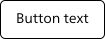
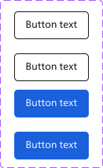

# Building a design system that Scales with Your Organization: Tips and Tricks

Design systems have become more popular in recent years. However, there is still much to learn about how design systems can be used to their full potential, and how organizations can benefit from them with the right tools. A well-designed design system can significantly improve an organization's design workflow, efficiency, and consistency, ultimately leading to better user experiences.

The exact meaning of a design system differs among the web. According to the [Niels Norman group](https://www.nngroup.com/), a design system is a set of standards to manage design at scale by reducing redundancy while creating a shared language and visual consistency across different pages and channels. These standards - or what I rather call an alignment - for your brand isn’t something new. Designers and developers have been aligning with multiple systems and tools for as long as styling your website in HTML tables was the standard. But over the years we developed better tools to do this. It is important to recognize that a design “system” is more than just a component library.

Design systems are made of many components, patterns, styles, and guidelines, which can help optimize your design efforts. A design system should at least have the following items:

- **Brand language and identity**, containing implementation guidelines, visual references, and design principles for creating interfaces.
- **Reusable components**, modular components that can be used across different applications or interfaces. A component should have a name, description, attribute, state, code snippet and implementation for developers.
- **Patterns**, are the building instructions that you need to use the components effectively across all your products.

However, they are designed, managed, and implemented by people. This means that a design system is something that keeps on living and growing. That is why I see a design system as a **way of working**.

## Tokenizing your designs

Design systems can become a large living organism. It is important to give structure to your documents to bridge the gap between the system and your implementation for every platform you convert to (web, iOS, Android etc.). To do this, you can use “design tokens”, which are like the building blocks of your design system. They're kind of like subatomic particles that make up all of the different style values that designers use to create the look and feel of a product.Tokens can give you grip and structure.

To realize this structure the [DTCG (Design Token Community Group)](https://github.com/design-tokens/community-group) has created a standard for design tokens. They try to provide standards upon which products and design tools can rely for sharing stylistic pieces of a design system at scale. They believe that a common way to share design tokens will unlock efficiency opportunities for plugins, design system teams, product teams, and end-users of design tools.

### Documenting your design tokens

With the rise of design systems, there has been a growing need for tools that can help designers and developers to manage and document these tokens directly within their design tool. Tools like [Token Studio (Figma tokens)](https://tokens.studio/) have made it easier to follow the DTCG standard. The plugin uses a JSON format to keep track of your tokens. This makes it easy to share your tokens with other team members and developers. It also allows you to connect your tokens to GitHub, GitLab or some other [tools](https://docs.tokens.studio/sync/sync). By doing so, designers can share tokens with developers, enabling them to use the same values that were defined by designers. This can help to eliminate inconsistencies and reduce the amount of time spent on manual implementation.

### Naming your tokens

Giving effective names to your design tokens might take some effort. It should be a team effort to create a shared understanding of your visual style through design, code and other handoffs. A team should be able to recognize and recall the purposeful decision they made behind each token. Not just in code and documentation, but in design tools as well. I got some great inspiration from a [article](https://medium.com/eightshapes-llc/naming-tokens-in-design-systems-9e86c7444676) written by Nathan Curtis.


Design properties like color can be stored as regular variables.

```scss
$blue-400 = #2680EB;
```

The variable `$blue-400` can be used in your stylesheets. This approach helps you to structure your design but it does come with a downside. Variables don’t necessarily bridge the gap between naming and use. Designers need to know what options they should apply in a particular context. This is where the abstraction layer of design tokens comes in.

```scss
$button-cta-background-color = $blue-400;
```

The name of this token makes it clear that the color `$blue-400` serves as a background color for the call-to-action button. This makes it easier for designers to find the right token for the right context.

Naming your design tokens appropriately may require some effort. The process involves collaboration between designers, developers, and other stakeholders to ensure that each token has a clear and purposeful name that can be easily recognized and recalled by everyone involved. This includes not only documentation and code, but also design tools.

We choose a naming convention separated by five different groups:

- Category
- Usage
- Component
- Variant
- State

Let me explain each group in more detail.

### Category tokens

Category tokens are the first layer of abstraction. They are the highest level of the token hierarchy. For example, you can use a category token to group all color, typography or spacing tokens together. This makes it easier to find all color tokens in your design system.

```scss
$colors-... = $blue-400;
```

#### Usage tokens

Usage tokens are the second layer of abstraction. Usage tokens describe where this token is used. For example, a text, background or icon token can be used on top of a category token.

```scss
$colors-background... = $blue-400;
```

#### Component tokens

Component tokens describe the component that the token is used for. For example, a button, input or card token can be used on top of a category token.

```scss
$colors-background-button... = $blue-400;
```

#### Variant tokens

A variant token is used when there is a variation of a component. For example, a primary, secondary or tertiary button token can be used on top of a category token.

```scss
$colors-background-button-primary... = $blue-400;
```

#### State tokens

The last layer is the state token. A state token is used when there is a state change of a component. For example, a hover, active or disabled button token can be used on top of a category token.

```scss
$colors-background-button-primary-hover = $blue-400;
```

These tokens are called alias tokens. They all rely on a base set of tokens, in this example `$blue-400`. This makes it easier to change the base token and have all the alias tokens change with it. This is a great way to create a consistent design system.


## Putting your tokens to the test

A simple yet efficient way to implement your design tokens is by using the atomic design methodology. Atomic design is a methodology composed of five distinct stages working together to create interface design systems in a more deliberate and hierarchical manner. The five stages of atomic design are:

- Atoms
- Molecules
- Organisms
- Templates
- Pages

By using this system we can start with smaller components and build them up to larger components. This helps us to create a consistent way to create new components. This also helps to get used to the new way of working. Let’s take a look at how we can use this to create a button component.

### Button example

For this example we assume we already defined our primary tokens, like colors, typography and spacing. We can use these tokens to create our button component. Let’s take a look at how we can use this methodology to create a button component:

```scss
$blue-400 = #1B60DB;
$white = #FFFFFF;
$black = #000000;
$font-size-base = 16px;
$font-weight-normal = 400;
$font-family-base = 'Roboto', sans-serif;
$spacing-1 = 4px;
$spacing-2 = 8px;
$spacing-3 = 16px;
$border-radius-base = 4px;
$border-width-base = 1px;
$box-shadow-base = 0 2px 4px 0 rgba(0, 0, 0, 0.1);
$box-shadow-none = 0 0px 0px 0 rgba(0, 0, 0, 0.0);
// etc...
```

I have created a simple button in Figma



The button atom consists of multiple properties. Even though the atom is not complex there are a lot of properties that we can use to style the button. Let's list all the properties that we can use to style the button:

- border-width
- border-color
- border-radius
- background-color
- box-shadow
- font-size
- font-weight
- font-family
- color
- padding
- margin

If we follow the naming convention mentioned earlier we create a lot of alias tokens. Let's define these properties in a `scss` file:

```scss
// Borders
$border-width-button = $border-width-base;
$border-color-button = $black;
$border-radius-button = $border-radius-base;
// Background
$background-color-button = $white;
// Box shadow
$box-shadow-button = $box-shadow-none;
// Typography
$font-size-button = $font-size-base;
$font-weight-button = $font-weight-normal;
$font-family-button = $font-family-base;
$color-button = $black;
// Spacing
$padding-button = $spacing-2 $spacing-3;
$margin = 0;
```

Now let's see what happens if we add variants and state to the buttons.



We now have two button variants, primary and secondary. We also have two button states, default and hover. Let’s take a look at the alias tokens we can create for the button molecule.

```scss
// Borders
$border-width-button-primary = $border-width-base;
$border-color-button-primary = $black;
$border-radius-button-primary = $border-radius-base;
$border-width-button-secondary = $border-width-base;
$border-color-button-secondary = $blue-400;
$border-radius-button-secondary = $border-radius-base;
// Background
$background-color-button-primary = $white;
$background-color-button-secondary = $blue-400;
// Box shadow
$box-shadow-button-primary = $box-shadow-none;
$box-shadow-button-secondary = $box-shadow-none;
// Typography
$font-size-button-primary = $font-size-base;
$font-weight-button-primary = $font-weight-normal;
$font-family-button-primary = $font-family-base;
$color-button-primary = $black;
$font-size-button-secondary = $font-size-base;
$font-weight-button-secondary = $font-weight-normal;
$font-family-button-secondary = $font-family-base;
$color-button-secondary = $white;
// Spacing
$padding-button-primary = $spacing-2 $spacing-3;
$margin-button-primary = 0;
$padding-button-secondary = $spacing-2 $spacing-3;
$margin-button-secondary = 0;
```

### Adding state

As we have seen in the button example, we can add state to our components. For example, a button can have a hover state. We can add this state to our button component.

```scss
// Borders
$border-width-button-primary-hover = $border-width-base;
$border-color-button-primary-hover = $black;
$border-radius-button-primary-hover = $border-radius-base;
$border-width-button-secondary-hover = $border-width-base;
$border-color-button-secondary-hover = $blue-400;
$border-radius-button-secondary-hover = $border-radius-base;
// Background
$background-color-button-primary-hover = $white;
$background-color-button-secondary-hover = $blue-400;
// Box shadow
$box-shadow-button-primary-hover = $box-shadow-base;
$box-shadow-button-secondary-hover = $box-shadow-base;
// Typography
$font-size-button-primary-hover = $font-size-base;
$font-weight-button-primary-hover = $font-weight-normal;
$font-family-button-primary-hover = $font-family-base;
$color-button-primary-hover = $black;
$font-size-button-secondary-hover = $font-size-base;
$font-weight-button-secondary-hover = $font-weight-normal;
$font-family-button-secondary-hover = $font-family-base;
$color-button-secondary-hover = $white;
// Spacing
$padding-button-primary-hover = $spacing-2 $spacing-3;
$margin-button-primary-hover = 0;
$padding-button-secondary-hover = $spacing-2 $spacing-3;
$margin-button-secondary-hover = 0;
```

As you can see, we have a lot of alias tokens. This is just for one button component. Imagine how many alias tokens we have for a complete design system. This is why it is important to create a naming convention.

### Reducing the number of tokens

As your design system keeps on growing it is important to keep track of your tokens. As we have seen in the button example, we have a lot of alias tokens. This is just for one button component. Reducing the amount of tokens is not an easy task. The example button component I created has a lot of duplicate tokens. For example, the hover state only changes the box shadow. We can reduce the amount of tokens by creating a box shadow token for the button component. Let's remove all the duplicate tokens from the button component:

```scss
// Borders
$border-width-button = $border-width-base;
$border-color-button-primary = $black;
$border-color-button-secondary = $blue-400;
$border-radius-button = $border-radius-base;
// Background
$background-color-button-primary = $white;
$background-color-button-secondary = $blue-400;
// Box shadow
$box-shadow-button = $box-shadow-none;
$box-shadow-button-primary-hover = $box-shadow-base;
$box-shadow-button-secondary-hover = $box-shadow-base;
// Typography
$font-size-button = $font-size-base;
$font-weight-button = $font-weight-normal;
$font-family-button = $font-family-base;
$color-button-primary = $black;
$color-button-secondary = $white;
// Spacing
$padding-button = $spacing-2 $spacing-3;
$margin-button = 0;
```

Combining tokens can be a risk. In my experience though it is best to keep the amount of alias tokens to a minimum. Adding state or variants to tokens in a later stage is a lot easier then removing duplicate tokens as you might not know where they are used. Before implementing a new atom it is best to think ahead. What are the different states of this atom? What are the different variants of this atom? This will help you to reduce the amount of tokens. When following this naming convention it is best to look at the HTML border box model. This syntax helps us to create a consistent way to create new components. It also helps us to reduce the amount of tokens. Let's take a look at the HTML border syntax:


## Translating your tokens to code

Until this point, we have discussed the importance of design tokens and how they can help us to create a design system, but how do we implement them in our code? As we connected our design tokens to GitHub, we can use the same tokens in our code. As design tokens are just variables, created in a JSON file, we can implement them in any programming language. We can use [style-dictionary](https://amzn.github.io/style-dictionary/#/) to convert our design tokens to any platform we want. The design tokens are the single source of truth. From there we can generate our code to each platform we want for your organization. We want to use the same tokens in our CSS, JavaScript, Android, iOS, and other platforms. This helps us to create a consistent way to share design tokens across platforms. Their motto is: define styles once, use them everywhere. Let's take a look at how we can use style-dictionary to generate our design tokens (JSON files) to usable CSS for example.

Style dictionary can be installed as a CLI tool or as a node module. Style dictionaries are configuration driven. Your configuration lets Style Dictionary know where to find your tokens and how to transform them. Let's use a simple configuration file to generate our design tokens to CSS.

```json
{
  "source": ["tokens/**/*.json"],
  "platforms": {
    "css": {
      "transformGroup": "css",
      "buildPath": "dist/css/",
      "files": [
        {
          "destination": "variables.css",
          "format": "css/variables"
        }
      ]
    }
  }
}
```

Let's use the following design tokens (JSON) as a base for our design system. This JSON is automatically created by plugins like Token Studio.

```json
// tokens/color.json
{
  "color": {
    "black": { "value": "#000000" },
    "font": {
      "primary": { "value": "{color.black.value}" },
      "input": { "value": "{color.font.primary.value}" }
    }
  }
}
```

We can see a couple of references to other tokens. For example `{color.black.value}`. Style dictionary maps through these values recursively and replaces them with the actual value for our output. Using the `style-dictionary build` command, we can generate our design tokens to CSS.

```css
:root {
  --color-black: #000000;
  --color-font-primary: #000000;
  --color-font-input: #000000;
}
```

We can use the generated CSS variables in our projects.

Style dictionary is highly configurable. We can transform token names, add prefixes, suffixes, and other transformations. We can also add custom formats, transforms, and actions. For example we can add a custom transform to convert time tokens (if needed).

```js
StyleDictionary.registerTransform({
  name: "time/seconds",
  type: "value",
  matcher: function (token) {
    return token.attributes.category === "time";
  },
  transformer: function (token) {
    // Note the use of prop.original.value,
    // before any transforms are performed, the build system
    // clones the original token to the 'original' attribute.
    return (parseInt(token.original.value) / 1000).toString() + "s";
  },
});
```

If you want to learn more about style dictionary, I recommend you to check out their [documentation](https://amzn.github.io/style-dictionary/#/). Keep in mind that style dictionary parses all files recursively in the source folder. This means that you can split your tokens into multiple files. For example, you can split your tokens into a `color.json`, `spacing.json`, `typography.json`, and `border.json` file. This makes it easier to maintain your tokens.

## Conclusion

Setting up a design system for your organization can be a daunting task. But by following the right steps, you can create a design system that scales with your organization. Design tokens can help you to create a consistent way to share design across platforms. They can also help you to create a consistent way to share design tokens across platforms. This helps you to create a single source of truth for your design system. This single source of truth can be used to generate code for each platform you want.

A design system should be a new way of working for your organization. This does not mean you should change your way of working overnight. It is important to take small steps and keep reevaluating your system. This helps you to keep your system up to date and relevant. Keep it simple in the beginning but keep in mind that your system should be able to scale with your organization. It is important to think ahead and keep reevaluating your system. The most important step in creating a design system is communication and documentation.
