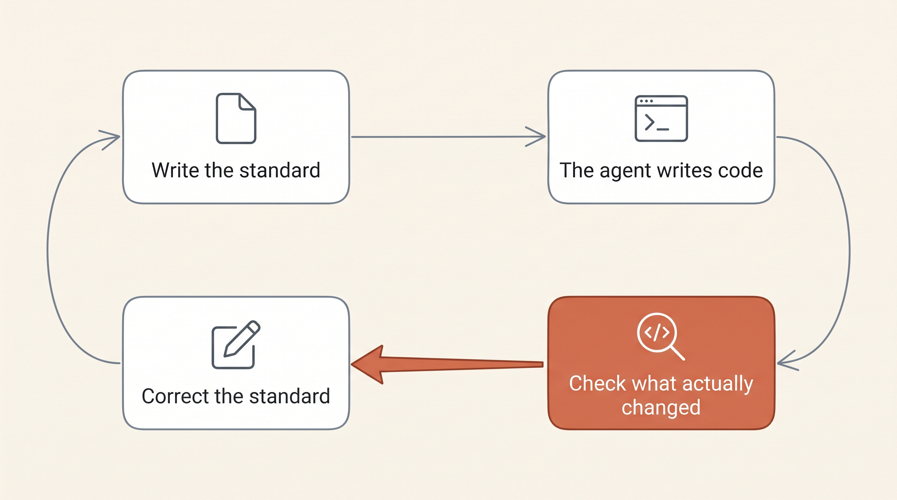

# You can't put a career in a SKILL.md

Nobody became a good developer by reading the onboarding wiki. You got there by shipping things for a few years, breaking a release or two, and picking up a hundred small judgments that nobody ever wrote down. Somebody once told you why that branch should have been split before it reached forty files. Somebody pushed back on a ticket you thought was fine, and it turned out to be three tickets in a coat.

For the past few weeks I have been doing two things. Writing down how I build software, in enough detail that an agent can follow it, and then building ways to find out whether it actually did. The first half took an afternoon. The second half has taken everything since, and it is the half almost nobody talks about.

That gap is what this series is about. The stance underneath it is short: your experience is the only part of this that does not expire, and writing it down is not the same as it landing. Everybody is polishing the file, and almost nobody is checking whether the code coming out the other end is any different. I could not find one person who had, so I went and measured my own. These posts are what came back, including the parts that led nowhere.

## Table of contents

- [The file that fixed it](#the-file-that-fixed-it)
- [The model learned from everybody](#the-model-learned-from-everybody)
- [Writing it down is the easy half](#writing-it-down-is-the-easy-half)
- [Come along](#come-along)

## The file that fixed it

Go to any conference this year and somebody will show you the file that fixed it. A `SKILL.md`, a `CLAUDE.md`, a tool that tidies your codebase while you sleep. The slides look great and the examples are real, and I have copied a few of them myself, so this is not me standing outside throwing rocks.

Take Caveman, which was one of the ones I copied. Drop the articles, drop the pleasantries, keep the technical nouns, and the agent burns fewer tokens. It shipped with a number attached, 65% fewer output tokens, and a number that size stops people asking questions. It went round talks and threads and newsletters for a couple of months, and I repeated it too, because it sounded right and cost nothing to try. Then JetBrains [actually measured it](https://blog.jetbrains.com/ai/2026/07/speak-to-ai-agents-like-cavemen-tosave-tokens/). Across 86 tasks and 240 trials the real saving was 8.5%, and in absolute totals the Caveman arm came out 11.6% more expensive, because one outlier task swamped everything it had saved. Quality did not move in either direction: 8 tasks better, 10 worse, 64 tied.

That is where this started for me, and not because one skill turned out to be oversold. Plenty of these files do work. The realisation was that I had no way of telling a file that works from a file that feels like it works, and neither did anybody I asked. I had been running on exactly the same instinct as the people on the stage. So has everybody I've talked to about it since.

## The model learned from everybody

There is a second reason to be careful here, and it has nothing to do with who measured what. The model learned to write code from an enormous amount of code. Most of it was written by people who do not work the way you do, under constraints you do not have. It read the careful repositories and the abandoned ones with equal attention, and what comes back out is an average. An average is the exact thing you have spent years trying not to be.

You already know what good looks like in your codebase. You know which component everybody copies and which commit message will still make sense in eight months. You know which branch should have been split and which ticket is too vague for anybody to start on. Nobody handed you that in a document. You argued your way to it over years, with people, and it does not expire when the next model ships. That matters more than it sounds, because everything else here has a short shelf life. A phrasing that saves tokens on one model is dead weight on the next one. If your advantage is a wording you copied out of a thread in spring, you're shopping for a new one by autumn.

So the job is not to find the prompt that makes the AI good at React. You are already good at React. The job is to get what you know in front of it, so it builds from your standard instead of from everybody else's average. In practice that means rules narrow enough to be wrong in somebody else's repository.

```md
- I ship React. Never suggest an Angular or Vue pattern, not even as an alternative.
- Session state goes through `useSession`. Never a raw token, never `localStorage`.
- Server components by default. `'use client'` needs a one-line reason in the PR body.
- A component past 150 lines gets split before review. Route-level pages are exempt.
```

I would never say any of that out loud to another developer, because anybody who has worked in this codebase already knows it. The things that go without saying are exactly the things that never get written down, which is the awkward part of all this. The knowledge hardest to hand over is the knowledge you forgot you had.

## Writing it down is the easy half

The afternoon itself was fine. You sit, write out how you build components, and get up feeling like you solved something. I was pleased with what I had.

<!-- TODO: Dennis - swap in the real detail. How long was the document, and what did the model actually do with it? This is the one mistake of your own in the post and the concrete version is worth far more than the general point. -->

What I could not do was answer the next question, which is whether any of it landed. A junior tells you, eventually. They ask something in week two that shows they got half of it. They drift back to the old pattern under a deadline and you catch it in review. Over a few months you find out what stuck and what did not, and none of that costs you anything extra. A model hands you none of those signals. It agrees at any hour, with exactly the same confidence, whether it read your standard or ignored it completely.



So you go and check, and checking is harder than it sounds. You can't assert `toEqual` on a code review. Run the same review twice and you get two wordings, two orderings, and sometimes a finding that shows up once and never again. Everything you know about testing was built for systems that do the same thing twice, and very little of it survives contact with one that does not. That is not a good enough reason to skip it. It is a good enough reason that almost nobody publishes numbers, because writing the file keeps feeling like progress while measuring it feels like admitting you can't tell.

## Come along

So I want to be straight about what is coming and what is not. There is no method here, and I would be careful of anybody claiming to have one this early. What I have is a set of measurements I built because I could not find anybody else's, and a fairly honest record of which parts were worth the effort. That last part is the bit I would have wanted to read a few weeks ago.

1. Writing a React architecture standard and then testing it. Planted violations, an answer key, the trap that catches an over-eager reviewer, and an A/B test that asks whether the document helped at all.
2. Backlog management and refinement, or getting an agent to work a ticket roughly the way I would work a ticket.
3. Git worktrees and orchestration, and running several agents at once without them climbing over each other.

Every one comes with what I measured, including the places where the answer was that it made no difference. None of it is really about my React standards and you should not adopt them. The part worth taking is the habit. Write down how you actually work, then go and find out whether it survived the trip. It scales up to a whole team if you want it to, but you can start it alone on a Tuesday, which is what I did. You spent years building the way you work and almost none of it is written down. The model will pick up none of it on its own, and it is also the only colleague you will ever have who reads exactly what you give it, every single time. That is a better offer than it first looks.
